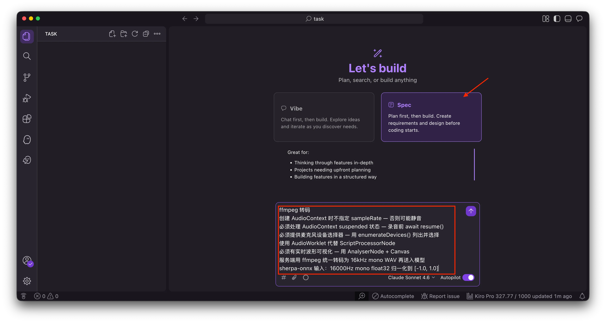
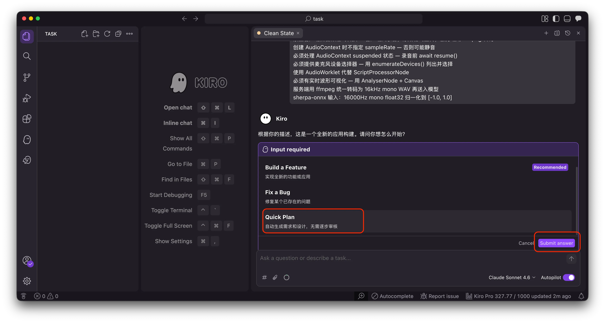
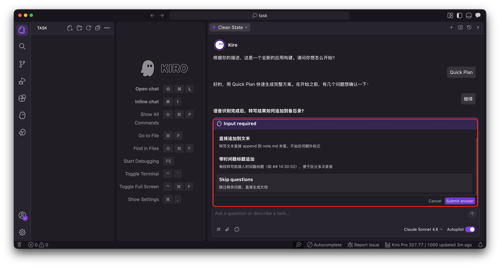
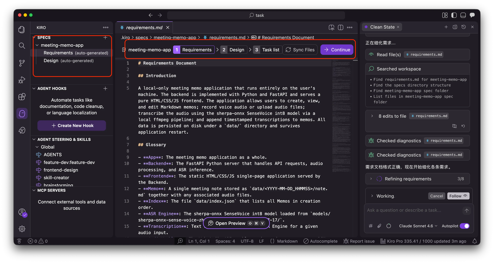
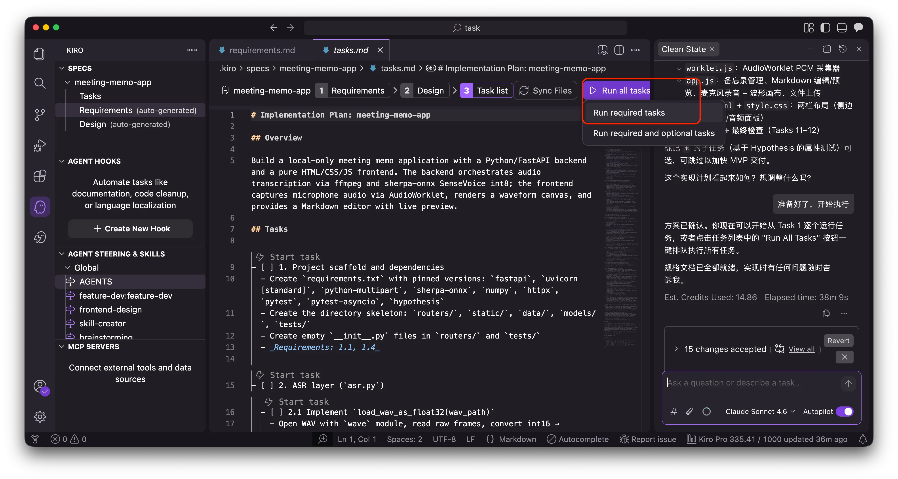
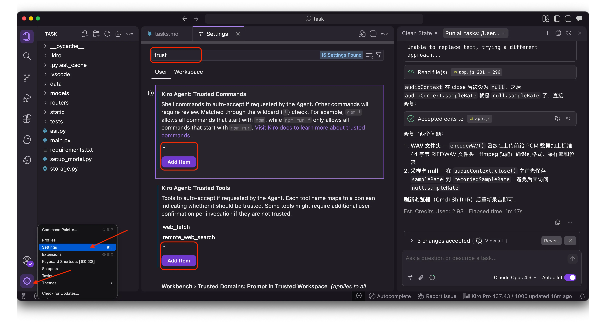
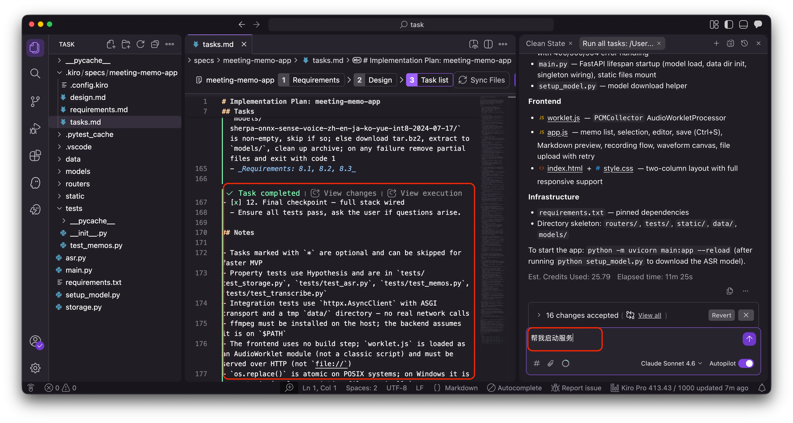
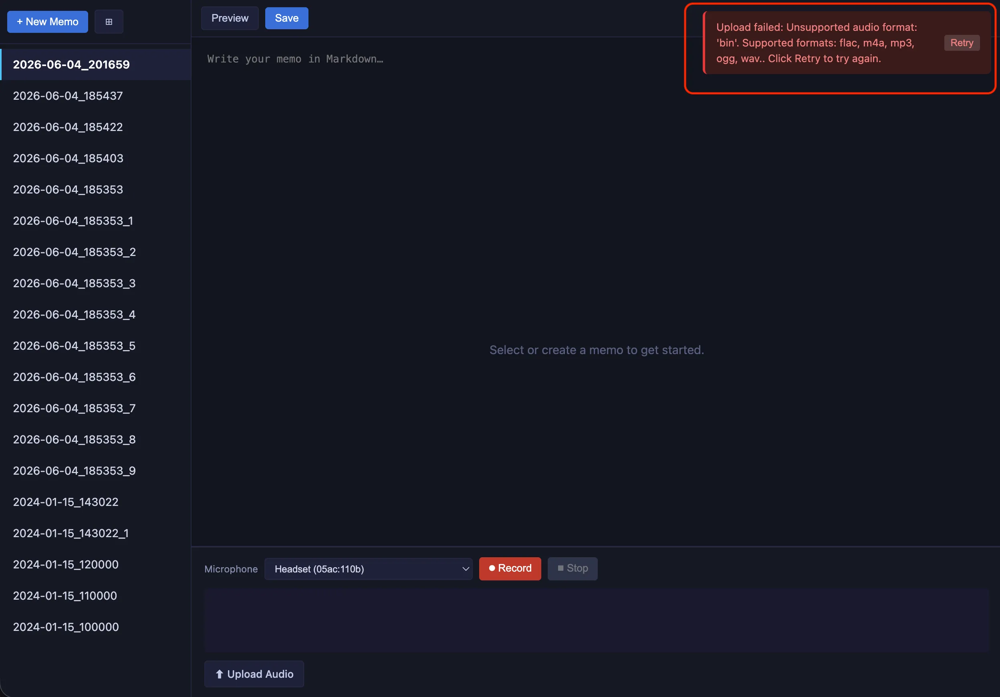
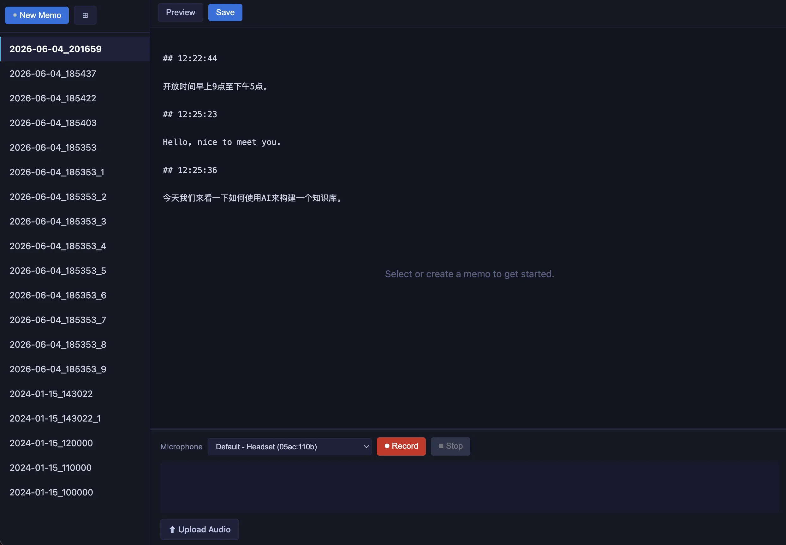

# Kiro Workshop 实验手册：构建会议备忘录应用

## 实验概述

在本实验中，你将使用 Kiro IDE 的 Spec 模式，从一段需求描述出发，让 AI Agent 自动完成需求分析、技术设计、任务拆解和代码实现，最终得到一个可运行的本地会议备忘录应用。

为降低风险、便于排查，整个开发**分两个阶段**：

- **阶段一**：先构建一个纯文字的备忘录应用（无语音，稳定、无 AI 依赖）。
- **阶段二**：在阶段一基础上加入语音录入与本地转写。

先把阶段一完整跑通，再进阶段二；这样一旦出问题，能确定就是语音部分。

**最终成果**：一个本地运行的 Web 应用，支持创建备忘录、Markdown 文字编辑、语音录入自动转写。

**预计时间**：30-45 分钟

---

## 第 1 步：安装 Kiro IDE

从 [https://kiro.dev](https://kiro.dev) 下载并安装 Kiro IDE，登录后打开一个空文件夹作为项目目录。

> **环境配置交给 Kiro**：Python 依赖、ffmpeg、模型下载等准备工作不需要手动操作，在输入需求时一并告诉 Kiro，让它来处理。

---

## 第 2 步：阶段一 — 用 Spec 模式开发备忘录应用

### 2.1 进入 Spec 模式

在 Kiro 中切换到 **Spec 模式**（而非 Vibe 模式）。

### 2.2 输入阶段一需求提示词

将以下需求描述粘贴到 Spec 会话中（这一阶段先不做语音）：

---

> 构建一个本地运行的会议备忘录应用（第一阶段，先不做语音）。
>
> **功能需求：**
> - 可以创建多条备忘录（自动以时间戳命名）
> - 备忘录列表展示，可切换查看
> - 每条备忘录支持 Markdown 文本编辑（实时预览）
> - 数据持久化到本地文件，重新打开可加载
> - 不需要写测试，代码越简单越好
>
> **技术架构：**
> - 后端：Python + FastAPI
> - 前端：纯 HTML/CSS/JS，由 FastAPI 托管，不需要 Node.js
> - 请先检查并准备好运行环境：确认 Python 3 已安装，安装 pip 依赖（fastapi uvicorn）
>
> **存储规则：**
> - 所有数据存在 `data/` 目录，每条备忘录一个子目录（如 `data/2024-07-18_143052/`）
> - 文字笔记存为 `note.md`
> - 用 JSON 索引文件管理元数据

---

### 2.3 选择 Quick Plan 模式

Kiro 会询问你想用什么方式开发，选择 **Quick Plan**（快速生成计划）：

### 2.4 回答澄清问题

Kiro 可能会针对需求提出一些澄清问题，根据实际情况回答即可：

### 2.5 确认需求文档

Kiro 会自动生成需求文档，检查是否符合预期：

### 2.6 执行任务

确认后，点击 **Run All Tasks** 让 Kiro 自动实现代码：

> **提示**：为了快速完成开发，仅执行必要的 task，标记为 optional 的任务之后再考虑执行。

> **注意**：执行过程中 Kiro 可能会弹出工具调用权限请求（如执行终端命令、写入文件等），需要点击 **Approve** 同意后才能继续。
>
> 如果想跳过所有权限确认，可以在 Kiro 设置中将工具设为自动信任（Trust All Tools）：
>
> 

---

## 第 3 步：启动并测试阶段一（备忘录）

### 3.1 启动服务

当所有任务都显示为 ✅ complete 后，直接在 Kiro 聊天中输入"启动应用"，让 Kiro 帮你启动服务。

### 3.2 打开应用

按照 Kiro 启动服务后提示的链接（通常是 `http://localhost:8000`），复制粘贴到 Chrome 浏览器中打开。

### 3.3 调试问题

如果遇到报错信息（终端报错、浏览器控制台报错等），直接把报错信息复制粘贴给 Kiro，让它帮你 debug：

### 3.4 阶段一功能验证清单

| 测试项 | 操作 | 预期结果 |
|--------|------|----------|
| 创建备忘录 | 点击"新建" | 出现新的备忘录条目 |
| 文字编辑 | 输入 Markdown 文本 | 内容被保存，预览正常 |
| 切换查看 | 在列表中点选 | 切换到对应备忘录 |
| 持久化 | 刷新页面 | 之前的备忘录仍然存在 |

> 阶段一验证通过后，再进入第 4 步。

---

## 第 4 步：阶段二 — 加入语音录入与转写

在同一个项目里，继续用 Spec 模式输入下面的需求，让 Kiro **在已有备忘录应用基础上新增语音功能**（不改动已 work 的部分）。流程与第 2、3 步相同：Quick Plan → 确认需求 → Run All Tasks → 启动测试。

### 4.1 输入阶段二需求提示词

> 在上面备忘录应用基础上，新增语音录入与转写（第二阶段），不要改动已 work 的功能。
>
> **功能需求：**
> - 点击"开始录音"开始录制，录制中显示实时波形
> - 点击"停止"后自动发送后端转写，结果追加到当前备忘录末尾
> - 支持上传音频文件（wav/mp3/m4a 等）转写
> - 录音保存原始音频文件，同时保存转写文本
>
> **技术架构：**
> - 语音识别：sherpa-onnx SenseVoice int8，路径 `models/sherpa-onnx-sense-voice-zh-en-ja-ko-yue-int8-2024-07-17/`
> - 模型下载：`https://du7u4d2q1sjz6.cloudfront.net/sherpa-onnx-sense-voice-zh-en-ja-ko-yue-int8-2024-07-17.tar.bz2`
> - 请先准备环境：确认 ffmpeg 已安装，安装 pip 依赖（sherpa-onnx），下载模型解压到 `models/` 目录
>
> **硬性约束（录音踩坑经验，必须遵守）：**
> 1. 禁止客户端做音频格式转换 — 客户端只录音，原始格式上传，服务端用 ffmpeg 转码
> 2. 创建 AudioContext 时不指定 sampleRate — 否则可能静音
> 3. 必须处理 AudioContext suspended 状态 — 录音前 await resume()
> 4. 必须提供麦克风设备选择器 — 用 enumerateDevices() 列出并选择
> 5. 使用 AudioWorklet 代替 ScriptProcessorNode
> 6. 必须有实时波形可视化 — 用 AnalyserNode + Canvas
> 7. 服务端用 ffmpeg 统一转码为 16kHz mono WAV 再送入模型
> 8. sherpa-onnx 输入：16000Hz mono float32 归一化到 [-1.0, 1.0]

### 4.2 执行任务并启动

同样 **Run All Tasks**，完成后让 Kiro"启动应用"。首次运行可能需要下载模型，按 Kiro 输出提示操作。

### 4.3 阶段二功能验证清单

| 测试项 | 操作 | 预期结果 |
|--------|------|----------|
| 选择麦克风 | 下拉选择设备 | 列表显示所有音频输入设备 |
| 录音 | 点击开始录音 | 波形显示有波动 |
| 转写 | 点击停止 | 自动转写并追加文字到备忘录 |
| 上传转写 | 上传音频文件 | 自动转写并追加 |

### 4.4 常见问题排查

遇到任何使用问题，直接用自然语言描述现象输入给 Kiro，让它排查并修复。例如：

- "录音波形一直是直线，没有声音"
- "点击停止后没有反应"
- "转写返回的是乱码"
- "刷新页面后之前的备忘录消失了"

Kiro 会根据你的描述自动分析代码、定位问题并给出修复方案。

---

## 第 5 步：回顾与总结

完成实验后，思考以下问题：

1. Spec 模式生成的需求文档、设计文档是否准确反映了你的意图？
2. 在哪些地方你需要手动干预或修正 Agent 的输出？
3. 分两阶段开发（先备忘录、再加语音）对排查问题有什么帮助？
4. 硬性约束（踩坑经验）对 Agent 的实现质量有什么影响？

---

## 课后作业（可选探索）

以下每个方向都可以作为新的需求，再次使用 Kiro Spec 模式让 Agent 实现：

- **会议纪要自动生成**：录音结束后，自动生成包含要点摘要、决策结论、待办事项的结构化纪要
- **说话人识别**：多人会议时自动区分谁在说话，标注发言人
- **实时字幕**：录音过程中边录边出文字，像视频字幕一样实时显示
- **智能提醒**：从会议内容中自动提取时间和截止日期，生成待办提醒
- **会议回放**：点击文字段落时跳转到对应录音位置播放
- **多语言支持**：参会者说不同语言时，自动翻译成统一语言的纪要
- **团队协作**：多人同时编辑同一份备忘录
- **知识库搜索**：跨多次会议搜索历史讨论内容
- **会议模板**：周会、1v1、头脑风暴等场景的预设模板
- **语音指令**：说"标记重点"、"新建待办"时自动执行对应操作
